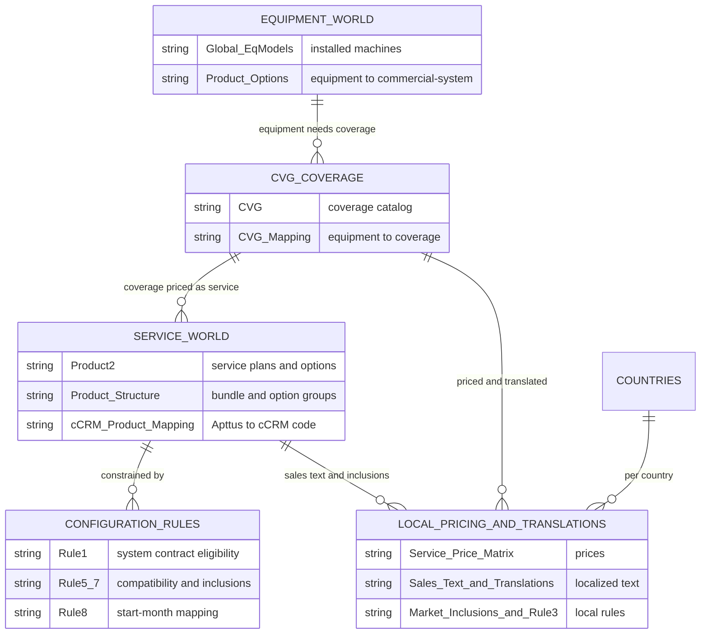

# Salesforce / Apttus CPQ Service-Catalog — Data Model & ERD

> Reverse-engineered from the workbooks in `00. Previous Release/Old Global/` and
> `00. Previous Release/Old Local/`. This document explains **what the data is**, **how the
> tables relate**, and provides a full **column-level ERD** (Mermaid) plus the mapping back to
> the real **Salesforce objects** these files load into.

---

## 1. What this data is (the big picture)

This is the **data-load source for a CPQ (Configure-Price-Quote) system built on Salesforce +
Apttus** (the Apttus/Conga CPQ managed package, `Apttus_Config2__*`). The business is
**service & maintenance contracts for installed medical-imaging equipment** — the product names
in the data (Ambient Experience "AE", *Practix* mobile X-ray, *Breeze* MR coils, "Kitten Scanner")
identify a large medical-imaging OEM (Philips Healthcare) and its aftermarket service business.

A sales rep selects a customer's installed machines and configures a service plan. The data here
tells the CPQ engine, for each market:

- **which coverages** apply to which equipment,
- **which service options** are eligible, auto-included, or mutually exclusive (the *Rules*),
- **how much** each covered service costs (per country, per currency), and
- **how everything reads** on the customer-facing document, translated into the local language.

The set is a **point-in-time snapshot**, dated `27.Jan.26` (a few files `30.Jan.26` / `17.Feb.26`),
labelled *"Q1'26"* — i.e. the Q1-2026 catalog release. `00. Previous Release` means it is the
prior release kept for reference/diff against the next one.

### Global vs. Local

| | `Old Global/` (13 files) | `Old Local/<CC>/` (45 countries × ~9 files) |
|---|---|---|
| **Scope** | Master / reference data, market-independent | Country-specific data |
| **Contains** | Product catalog, coverages, equipment, and the configuration **Rules** | Translations, **pricing**, market inclusions, per-country rule variants |
| **Keyed by** | product / coverage / equipment codes | `Country` (ISO-2) + the global codes |

The 45 local folders are ISO-2 country codes (AT, AU, BR, CA, CN, DE, ES, FR, GB, JP, US, …). Each
holds the same ~9 file types (a few countries omit `Service_Price_Matrix` or `RSMType_Translation`).

### The two "product worlds" (key to reading the model)

The single most important thing to understand is that **"product" means two different things**:

1. **Equipment world** — the customer's *installed machines* (Equipment Codes like `15KVAUPS`,
   `NCVD252`, `888001`). Lives in **`Global_EqModels`**, grouped through **`Product_Options`**
   into *Commercial Systems*, and linked to coverages by **`CVG_Mapping`**.
2. **Service world** — the *sellable service products* (service plans & options, codes like
   `CS_792002` "CC Service Plan", `CS_NPC_CIR_IN`). Lives in **`Product2`** and is what actually
   goes on the quote / gets priced.

The bridge between the two worlds is the **CVG (Coverage / "CoVeraGe" Group)**: equipment maps to
CVGs, and CVGs (with a service) get priced. This is verified by the joins in §6.

---

## 2. Glossary

| Term | Meaning |
|---|---|
| **CPQ** | Configure-Price-Quote — the sales engine that assembles & prices a quote. |
| **Apttus / `Apttus_Config2__`** | The CPQ managed package on Salesforce (now Conga CPQ). |
| **`APTS_` prefix** | The customer's own custom namespace (their `__c` fields / objects). |
| **CVG** | **Coverage** (a.k.a. Coverage Group) — a unit of what a service contract covers (e.g. a specific coil, spare-parts pool, software-license upgrade). Central bridge entity. |
| **Product2** | Salesforce's standard product object — here it holds the **service** catalog (plans + options). |
| **SVC Model / SVC Model Code** | A *service-plan* product (e.g. `CS_792002` "CC Service Plan"). A subset of `Product2`. |
| **Option / Option Group** | Configurable line items under a service plan (the bundle structure in `Product_Structure`). |
| **Entitlement** | A specific covered benefit/option code used by the Rules (`CS_..._EX`, `CS_..._IN`). |
| **MPC Entitlement** | An entitlement family / "Multi-Period Contract" entitlement code (e.g. `CS_MPC_EW_BAL`). |
| **RSM Type** | Consumption / replacement model of a parts pool ("Combined Pool", "Bank of Parts", "Block of Transducers"). |
| **Service Plan Type** | Commercial plan tier ("Comp Onsite", "Perf Assurance", "AVW RightFit Value"). |
| **Start-Month Attribute** | When the coverage clock starts ("After Warranty", "At Handover"). |
| **Modality** | Equipment family / imaging discipline (AE, MR, CT, …). |
| **CFD** | **Customer-Facing Document** *(inferred)* — the generated quote/contract/exhibit output. "Exclude from CFD" hides a line from that document; `CFD_Exhibits_Definitions` / `CFD Localization` feed it. |
| **CNA / NBV** | Pricing attributes: *Cost Not Applicable* flag / *Net Book Value*. |
| **iTest** | The consolidated Salesforce **load/import** workbook (`Local Files Q1'26 iTest.xlsx`). |

---

## 3. Salesforce object map (the "Rosetta Stone")

`Old Local/Local Files Q1'26 iTest.xlsx` is the actual **data-loader import file** — it consolidates
every country into Salesforce-ready sheets and therefore reveals the real object/field API names
behind the friendly files. Each row's leading column carries an object token like
`[Apttus_cCRM_Equipmnt__c]`; `APTS_Ext_ID__c` is the external-ID upsert key; `__r` denotes a
Salesforce relationship (lookup) to a parent record's external id.

| Friendly file(s) | iTest sheet | Salesforce object (API name) | Key fields / lookups |
|---|---|---|---|
| `*_Apttus_cCRM_Eq_Price_Relevant_List` | *cCRM Equip Price Rel* | `Apttus_cCRM_Equipmnt__c` | `APTS_Ext_ID__c`, `APTS_Country__c`, `APTS_Product__r` → equipment product |
| `*_CVG_Translation` + global `CVG` | *CFD Localization* | `APTS_CFD_Localization__c` | `APTS_CVG__r` → CVG, `APTS_CFD_Language__c`, `APTS_Translated_value__c`, `APTS_Type__c` |
| `*_Sales_Text` | *Sales Text* | Apttus product sales-text records | `Apttus_Config2__ProductId__r` → `Product2`, `APTS_Country_Code__c`, `APTS_Language__c`, `APTS_Entitlement_Category__c` |
| `*_Service_Price_Matrix` | *SPM Activation* / *SPM Deactivate* | `APTS_Service_Price_Matrix__c` | `APTS_CVG__r` → CVG, `APTS_Service__r` → Product2, `CurrencyIsoCode`, `APTS_Active__c` |
| `*_Market_Inclusions` | *Mkt Inclusion* | constraint-rule source (Apttus) | `Option Code`, `Service Model Code`, `Key` |
| `*_Rule3_Product_Option_Compatibility` | *Rule-3* | Apttus constraint-rule condition/action | `Key`, `Check Key` |

`Product2`, `CVG`, `Countries`, `Global_EqModels`, and the global `Rule1/5/7/8` load into the
standard `Product2` object and the Apttus product/coverage/constraint-rule structures respectively;
`cCRM_Product_Mapping` bridges the Apttus product code to the legacy **cCRM** product code.

---

## 4. Domain overview diagram

---

## 5. Entity catalog (column-level)

Primary keys are marked **PK**; the columns that join to other tables are marked **FK →**.
Column names are the exact workbook headers.

### 5.1 Global — master data

**`Product2`** — the **service** product catalog (grain: one service product/option, optionally per language). **PK** `Product Code`.
`Product Code` **PK**, `Product Name`, `Commercial Product Name`, `Configuration Type`, `Type`, `Product Type`, `Product Business Type`, `Active`, `Must Configure`, `Has Attributes`, `Send to SAP`, `Service Classification`, `Service Cost Category`, `Service Product Category`, `Service Product Range`, `RSM Type` (→ `RSMType_Translation`), `Language Code`, `Language`, `Short Sales Text`, `Long Sales Text`, `Exclude from CFD`, `Validation`, `Send Service Product Hierarchy to SAP`.

**`Product_Structure`** (sheet `V_Product_Structure`) — the **bundle / option-group hierarchy** (BOM). Grain: one node/edge in the config tree. FK `Unique Product Code` → `Product2`; self-referencing `Parent` ↔ `Product/Option Group Name`.
`*cBOM Element`, `Unique Product Code` **FK**, `Product/Option Group Name`, `Parent` **FK(self)**, `Product Option Group Min Options`, `… Max Options`, `… Min Total Quantity`, `… Max Total Quantity`, `Product Option Component Min Quantity`, `… Max Quantity`, `… Default Quantity`, `… Quantity Modifiable(TRUE/FALSE)`.

**`Product_Options`** — flattens **equipment → commercial system** availability. FK `Product` → `Global_EqModels.Equipment Code`; `Commercial System Code` is the grouping key used by `CVG_Mapping`.
`Product` **FK**, `Product Description`, `Commercial System Code`, `Commercial System Description`.

**`CVG`** — the **coverage catalog** (the bridge entity). **PK** `CVG Code`; grouped by `Service Group Code`.
`CVG Code` **PK**, `CVG Description`, `Exclude from CFD`, `Service Group Code`, `Service Group Description`.

**`CVG_Mapping`** — **equipment/commercial-system → coverage** map with eligibility. FK `Product` → `Product_Options.Commercial System Code`; FK `CVG Code` → `CVG`.
`Product` **FK**, `Product Description`, `CVG Code` **FK**, `Qty`, `Active`, `Check Eligibility`, `Eligibility Message`.

**`Countries`** — country reference. **PK** `Country` (ISO-2).
`Country` **PK**, `Country Name`.

**`Global_EqModels`** — the **equipment master** (installed machines). **PK** `Equipment Code`.
`Modality Code`, `Equipment Code` **PK**, `Equipment Description`, `Service Product Category`, `Service Product Range`, `Service Product Hierarchy`, `PM Visits per year`, `PM Duration`, `Grouping`, `Product`, `Available CVG Groups (rule 7)`, `Not available CVG Groups (rule 5)`.

**`cCRM_Product_Mapping`** — bridges Apttus product code ↔ legacy cCRM code ↔ plan type. FK `Apttus_ProductCode` → `Product2`.
`Name`, `Apttus_ProductCode` **FK**, `CCRM_ProductCode`, `Service_Plan_Type__c` (→ `ServicePlanType_Translation`).

**`CFD_Exhibits_Definitions`** — exhibit blocks for the customer-facing document, per product. FK `Product Code` → `Product2`.
`Product Code` **FK**, `Product Desc`, `Code`, `Description`, `Type`.

**Rules** (all `condition → action` constraint tables; join `SVC Model Code`/`Entitlement Code` → `Product2` service world; `Country` → `Countries`):

- **`Rule1_Global_System_Contract_Eligibility`** — which service plans a system is eligible for.
  `Service Product Category (Condition)`, `Service Product Range (Condition)`, `Quote Type (Condition Criteria)`, `Match in Service Assets (Condition)`, `Match in Related Lines (Condition)`, `SVC Model Code (Action)` **FK**, `SVC Model Desc (Action)`.
- **`Rule5_Global_Product_Option_Compatibility`** — option exclusions.
  `Country` **FK**, `Quote Type`, `Not Available CVG Groups (Condition)`, `SVC Model Code (Condition)` **FK**, `SVC Model Desc (Condition)`, `Action`, `Match in Service Assets (Condition)`, `Match in Related Lines (Condition)`, `Entitlement Code (Action)`, `Action Disposition`, `Message`, `Key` **PK**.
- **`Rule7_Global_Equip_SP_LI_Inclusions`** — auto-inclusions from equipment + CVG group.
  `Country` **FK**, `Available CVG Groups (Condition)`, `SVC Model Code (Condition)` **FK**, `Entitlement Code (Condition)`, `Action`, `Match in Service Assets (Condition)`, `Match in Related Lines (Condition)`, `Entitlement Code (Action)`, `Action Intent`, `Action Disposition`, `Message`, `Key` **PK**.
- **`Rule8_Global_MPC_StartMonthAttribute_Mapping`** — maps MPC entitlement → start-month attribute.
  `Product Attribute Rule`, `Country` **FK**, `SVC Model Code (Condition)` **FK**, `SVC Model Desc (Condition)`, `MPC Entitlement Code (Condition)`, `Start Month Attribute Code (Action)` (→ `StartMonth_Translation`), `Action`, `Action Disposition`.

### 5.2 Local — per-country data (× 45 countries, all keyed by `Country` → `Countries`)

**`Apttus_cCRM_Eq_Price_Relevant_List`** — which equipment is price-relevant in the market. FK `Equip Model` → `Global_EqModels.Equipment Code`.
`Country` **FK**, `Equip Model` **FK**, `Equip Desc`.

**`Service_Price_Matrix`** — **the pricing table** (grain: one price for a CVG+Service, per country/currency). FK `CVG` → `CVG`; FK `Service` → `Product2`.
`Country` **FK**, `CVG` **FK**, `Service` **FK**, `Price Type`, `Monthly List Price`, `Monthly Target Price`, `Monthly Cost`, `Monthly NBV`, `CNA`, `Currency`, `Min Selling Term`, `Max Selling Term`, `Pricebook Name`, `Pricebook Simulation Date`, `Portfolio Name`, `Active`.

**`Market_Inclusions`** — per-market default inclusions. FK `Option Code` & `Service Model Code` → `Product2`.
`Option Code` **FK**, `Service Model Code` **FK**, `Country` **FK**, `Default`, `Product Range`, `MPC Entitlement`.

**`Rule3_Product_Option_Compatibility`** — the **local** sibling of Rules 5/7 (per-country compatibility & inclusion). FK `SVC Model Code`/`Entitlement Code` → `Product2`.
`Country` **FK**, `SVC Model Code (Condition)` **FK**, `SVC Model Desc (Condition)`, `Entitlement Code (Condition)`, `MPC Entitlement (Condition)`, `Match in Service Assets (Condition)`, `Match in Related Lines (Condition)`, `Action`, `SVC Model Code (Action)`, `SVC Model Desc (Action)`, `Entitlement Code (Action)`, `Action Intent`, `Action Disposition`, `Message`, `Key` **PK**.

**`Sales_Text`** — localized short/long sales text per service product. FK `Product Code` → `Product2`.
`Product Code` **FK**, `Product Name`, `Commercial Product Name`, `Country` **FK**, `Language`, `Category Desc`, `Sub-Category Desc`, `Short Sales Text`, `Long Sales Text`, `Exclude from CFD`.

**`CVG_Translation`** — localized CVG descriptions. FK `CVG Code` → `CVG`.
`CVG Code` **FK**, `CVG Description`, `Country` **FK**, `Country Language`, `CVG Description Translation`, `Exclude from CFD`.

**`ServicePlanType_Translation`** — localized plan-type labels (↔ `cCRM_Product_Mapping.Service_Plan_Type__c`).
`Service Plan Type Description` **FK**, `Country` **FK**, `Country Language`, `Service Plan Type Descr Translation`.

**`RSMType_Translation`** — localized parts-pool / consumption-type text (↔ `Product2.RSM Type` via `Global Description`).
`RSM Code`, `RSM Consumption Type`, `Country` **FK**, `Country Language`, `Global Description` **FK**, `Local Description`, `Local Header Sales Text`.

**`StartMonth_Translation`** — localized start-month labels (↔ `Rule8` start-month attribute).
`Start Month Attribute Code Description` **FK**, `Country` **FK**, `Country Language`, `Start Month Attr Code Descr Translation`.

---

## 6. ERD — Global master + rules

Column names are normalized to identifiers (underscores) for Mermaid; see §5 for exact headers.
Verified joins (row-count overlap): `CVG_Mapping.CVG_Code`→`CVG` 2444/2444 · `CVG_Mapping.Product`→`Product_Options.Commercial_System_Code` 5700/5700 · `Product_Options.Product`→`Global_EqModels.Equipment_Code` 1538/1538 · `Sales_Text`→`Product2` 306/306 · `Service_Price_Matrix.Service`→`Product2` 144/144 · `Service_Price_Matrix.CVG`→`CVG` 1375/1380.

```mermaid
erDiagram
    GLOBAL_EQMODELS   ||--o{ PRODUCT_OPTIONS : "Product = Equipment_Code"
    PRODUCT_OPTIONS   ||--o{ CVG_MAPPING     : "Commercial_System_Code"
    CVG               ||--o{ CVG_MAPPING     : "CVG_Code"
    PRODUCT2          ||--o{ PRODUCT_STRUCTURE : "Unique_Product_Code"
    PRODUCT_STRUCTURE ||--o{ PRODUCT_STRUCTURE : "Parent self-ref"
    PRODUCT2          ||--o{ CFD_EXHIBITS      : "Product_Code"
    PRODUCT2          ||--o{ CCRM_PRODUCT_MAPPING : "Apttus_ProductCode"
    PRODUCT2          ||--o{ RULE1_ELIGIBILITY    : "SVC_Model_Code"
    PRODUCT2          ||--o{ RULE5_COMPATIBILITY  : "SVC_Model_Code"
    PRODUCT2          ||--o{ RULE7_INCLUSIONS     : "SVC_Model_Code"
    PRODUCT2          ||--o{ RULE8_STARTMONTH     : "SVC_Model_Code"
    COUNTRIES         ||--o{ RULE5_COMPATIBILITY  : "Country"
    COUNTRIES         ||--o{ RULE7_INCLUSIONS     : "Country"
    COUNTRIES         ||--o{ RULE8_STARTMONTH     : "Country"

    PRODUCT2 {
        string Product_Code PK
        string Product_Name
        string Commercial_Product_Name
        string Type
        string Product_Type
        boolean Active
        string Service_Product_Category
        string Service_Product_Range
        string RSM_Type FK
        string Language
        boolean Exclude_from_CFD
    }
    PRODUCT_STRUCTURE {
        string cBOM_Element
        string Unique_Product_Code FK
        string Product_Option_Group_Name
        string Parent FK
        int Group_Min_Options
        int Group_Max_Options
        int Component_Min_Qty
        int Component_Max_Qty
        int Component_Default_Qty
        boolean Qty_Modifiable
    }
    PRODUCT_OPTIONS {
        string Product FK
        string Product_Description
        string Commercial_System_Code
        string Commercial_System_Description
    }
    GLOBAL_EQMODELS {
        string Equipment_Code PK
        string Modality_Code
        string Equipment_Description
        string Service_Product_Category
        string Service_Product_Range
        int PM_Visits_per_year
        string Available_CVG_Groups_rule7
        string Not_available_CVG_Groups_rule5
    }
    CVG {
        string CVG_Code PK
        string CVG_Description
        boolean Exclude_from_CFD
        string Service_Group_Code
        string Service_Group_Description
    }
    CVG_MAPPING {
        string Product FK
        string CVG_Code FK
        int Qty
        boolean Active
        boolean Check_Eligibility
        string Eligibility_Message
    }
    COUNTRIES {
        string Country PK
        string Country_Name
    }
    CCRM_PRODUCT_MAPPING {
        string Name
        string Apttus_ProductCode FK
        string CCRM_ProductCode
        string Service_Plan_Type_c
    }
    CFD_EXHIBITS {
        string Product_Code FK
        string Product_Desc
        string Code
        string Description
        string Type
    }
    RULE1_ELIGIBILITY {
        string Service_Product_Category_Cond
        string Service_Product_Range_Cond
        string Quote_Type_Cond
        string SVC_Model_Code_Action FK
        string SVC_Model_Desc_Action
    }
    RULE5_COMPATIBILITY {
        string Key PK
        string Country FK
        string Not_Available_CVG_Groups_Cond
        string SVC_Model_Code_Cond FK
        string Action
        string Entitlement_Code_Action
        string Action_Disposition
        string Message
    }
    RULE7_INCLUSIONS {
        string Key PK
        string Country FK
        string Available_CVG_Groups_Cond
        string SVC_Model_Code_Cond FK
        string Entitlement_Code_Cond
        string Entitlement_Code_Action
        string Action_Intent
        string Action_Disposition
    }
    RULE8_STARTMONTH {
        boolean Product_Attribute_Rule
        string Country FK
        string SVC_Model_Code_Cond FK
        string MPC_Entitlement_Code_Cond
        string Start_Month_Attribute_Code FK
        string Action_Disposition
    }
```

---

## 7. ERD — Local / per-country data

Every entity below is per-country; `Country` joins to `COUNTRIES`. Global parents (`PRODUCT2`,
`CVG`, `GLOBAL_EQMODELS`) are shown to make the foreign keys explicit.

```mermaid
erDiagram
    COUNTRIES       ||--o{ EQ_PRICE_RELEVANT_LIST : "Country"
    COUNTRIES       ||--o{ SERVICE_PRICE_MATRIX   : "Country"
    COUNTRIES       ||--o{ MARKET_INCLUSIONS      : "Country"
    COUNTRIES       ||--o{ RULE3_COMPATIBILITY    : "Country"
    COUNTRIES       ||--o{ SALES_TEXT             : "Country"
    COUNTRIES       ||--o{ CVG_TRANSLATION        : "Country"
    COUNTRIES       ||--o{ SERVICEPLANTYPE_TRANSLATION : "Country"
    COUNTRIES       ||--o{ RSMTYPE_TRANSLATION     : "Country"
    COUNTRIES       ||--o{ STARTMONTH_TRANSLATION  : "Country"

    GLOBAL_EQMODELS ||--o{ EQ_PRICE_RELEVANT_LIST : "Equip_Model = Equipment_Code"
    CVG             ||--o{ SERVICE_PRICE_MATRIX   : "CVG"
    CVG             ||--o{ CVG_TRANSLATION        : "CVG_Code"
    PRODUCT2        ||--o{ SERVICE_PRICE_MATRIX   : "Service"
    PRODUCT2        ||--o{ MARKET_INCLUSIONS      : "Option_Code / Service_Model_Code"
    PRODUCT2        ||--o{ RULE3_COMPATIBILITY    : "SVC_Model_Code"
    PRODUCT2        ||--o{ SALES_TEXT             : "Product_Code"
    PRODUCT2        ||--o{ RSMTYPE_TRANSLATION    : "RSM_Type = Global_Description"

    COUNTRIES { string Country PK }
    GLOBAL_EQMODELS { string Equipment_Code PK }
    CVG { string CVG_Code PK }
    PRODUCT2 { string Product_Code PK }

    EQ_PRICE_RELEVANT_LIST {
        string Country FK
        string Equip_Model FK
        string Equip_Desc
    }
    SERVICE_PRICE_MATRIX {
        string Country FK
        string CVG FK
        string Service FK
        string Price_Type
        number Monthly_List_Price
        number Monthly_Target_Price
        number Monthly_Cost
        number Monthly_NBV
        boolean CNA
        string Currency
        int Min_Selling_Term
        int Max_Selling_Term
        string Pricebook_Name
        string Portfolio_Name
        boolean Active
    }
    MARKET_INCLUSIONS {
        string Option_Code FK
        string Service_Model_Code FK
        string Country FK
        string Default
        string Product_Range
        string MPC_Entitlement
    }
    RULE3_COMPATIBILITY {
        string Key PK
        string Country FK
        string SVC_Model_Code_Cond FK
        string Entitlement_Code_Cond
        string MPC_Entitlement_Cond
        string Action
        string SVC_Model_Code_Action
        string Entitlement_Code_Action
        string Action_Intent
        string Action_Disposition
        string Message
    }
    SALES_TEXT {
        string Product_Code FK
        string Product_Name
        string Country FK
        string Language
        string Category_Desc
        string Sub_Category_Desc
        string Short_Sales_Text
        string Long_Sales_Text
        boolean Exclude_from_CFD
    }
    CVG_TRANSLATION {
        string CVG_Code FK
        string CVG_Description
        string Country FK
        string Country_Language
        string CVG_Description_Translation
        boolean Exclude_from_CFD
    }
    SERVICEPLANTYPE_TRANSLATION {
        string Service_Plan_Type_Description FK
        string Country FK
        string Country_Language
        string Service_Plan_Type_Descr_Translation
    }
    RSMTYPE_TRANSLATION {
        string RSM_Code
        string RSM_Consumption_Type
        string Country FK
        string Country_Language
        string Global_Description FK
        string Local_Description
        string Local_Header_Sales_Text
    }
    STARTMONTH_TRANSLATION {
        string Start_Month_Attribute_Code_Description FK
        string Country FK
        string Country_Language
        string Start_Month_Attr_Code_Descr_Translation
    }
```

---

## 8. How the data is used (configuration flow)

1. **Pick the installed equipment.** The rep selects the customer's machines from
   `Global_EqModels`, filtered per market by `Apttus_cCRM_Eq_Price_Relevant_List`.
2. **Determine required coverage.** `Product_Options` groups equipment into *Commercial Systems*;
   `CVG_Mapping` yields the applicable **CVGs** (coverages) for those systems.
3. **Choose a service plan & options.** `Rule1` decides which **SVC Model** (service plan in
   `Product2`) the system is eligible for. `Product_Structure` provides the bundle/option tree.
4. **Apply constraints.** `Rule7`/`Market_Inclusions` auto-include entitlements; `Rule5`/`Rule3`
   enforce compatibility & exclusions; `Rule8` sets the coverage **start month**. Local `Rule3`
   overrides/extends the global rules per country.
5. **Price it.** `Service_Price_Matrix` returns the monthly list/target/cost for each
   **CVG + Service**, in the market's `Currency`, from the named `Pricebook`.
6. **Localize the document.** `Sales_Text`, `CVG_Translation`, `ServicePlanType_Translation`,
   `RSMType_Translation`, `StartMonth_Translation`, and `CFD_Exhibits_Definitions` render the quote
   / customer-facing document in the local language, honoring the `Exclude from CFD` flags.

**Load direction:** the friendly per-country workbooks are consolidated into
`Local Files Q1'26 iTest.xlsx` and upserted into Salesforce/Apttus by `APTS_Ext_ID__c`
(see the object map in §3), with `Active` / `APTS_Active__c` toggling activation vs. deactivation.

---

## 9. Caveats

- **CFD** is expanded as *Customer-Facing Document* from context (translation, "Exclude from CFD",
  exhibits) — the acronym is not defined in the files themselves.
- `RSMType_Translation` links to `Product2.RSM Type` by **description text** (`Global Description`),
  not a code; treat it as a soft join.
- A small number of rule rows reference codes not present in the `Product2` snapshot (e.g. inactive
  or externally-managed entitlements) — expected for a point-in-time export.
- Row counts and joins in this document were computed from the `27.Jan.26` snapshot; a few files
  carry later dates (`30.Jan.26`, `17.Feb.26`).
